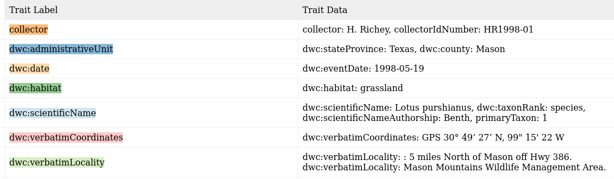
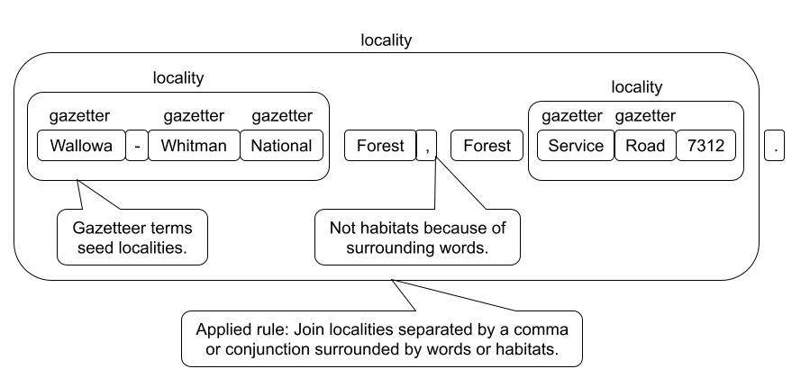

# LabelTraiter 

Extract traits about plants from labels on herbarium sheets.

## All right, what's this all about then?
**Challenge**: Extract trait information from labels on herbarium sheets. That is, if I'm given label text like: (Reformatted to emphasize targeted fields.)


I should be able to extract: (Colors correspond to the text above.)



## Rule-based parsing

The task is take text like this:
```
Herbarium of
San Diego State College
Erysimum capitatum (Dougl.) Greene.
Growing on bank beside Calif. Riding and
Hiking Trail north of Descanso.
13 May 1967 San Diego Co., Calif.
Coll: R.M. Beauchamp No. 484
```
And convert it into a machine-readable Darwin Core format like:
```json
{
    "dwc:eventDate": "1967-05-13",
    "dwc:verbatimEventDate": "13 May 1967",
    "dwc:country": "United States",
    "dwc:stateProvince": "California",
    "dwc:county": "San Diego",
    "dwc:recordNumber": "484",
    "dwc:verbatimLocality": "Bank beside California, Riding and Hiking Trail north of Descanso",
    "dwc:recordedBy": "R.M. Beauchamp",
    "dwc:scientificNameAuthorship": "Dougl Greene",
    "dwc:scientificName": "Erysimum capitatum (Dougl.) Greene",
    "dwc:taxonRank": "species"
}
```
Of course, the OCRed input text and the resulting JSON are not always this clean.

### Strategy

LabelTraiter uses a multistep approach to parse text into traits. The rules themselves are written using spaCy, with enhancements we developed to streamline the rule building process. The general outline of the rule building process follows:

1. Have experts identify relevant terms and target traits.
2. We use expert identified terms to label terms using spaCy's phrase matchers. These are sometimes traits themselves, but are more often used as anchors for more complex patterns of traits.
3. We then build up more complex terms from simpler terms using spaCy's rule-based matchers repeatedly until there is a recognizable trait. See the image below.
4. Depending on the trait we may then link traits to each other (entity relationships) using also spaCy rules.
   1. Typically, a trait gets linked to a higher level entity like SPECIES <--- FLOWER <--- {COLOR, SIZE, etc.} and not peer to peer like PERSON <---> ORG.

As an example of parsing a locality is shown below:



The rules can become complex and the vocabularies for things like taxa, or a gazetteer can be huge, but you should get the idea of what is involved in label parsing.

LabelTraiter was originally developed to parse plant treatments and was later adapted to parse label text. As such, it does have some issues with parsing label text. When dealing with treatments the identification of traits/terms is fairly easy and the linking of traits to their proper plant part is only slightly more difficult.

With labels, both the recognition of terms and linking them is difficult. There is often an elision of terms, museums or collectors may have their own abbreviations, and there is an inconsistent formatting of labels. Rule based-parsers are best at terms like dates, elevations, and latitudes/longitudes where the terms have recognizable structures, like numbers followed by units with a possible leading label. They are weakest is with vague terms like habitat, locality, or even names that require some sort of analysis of the context and meaning of the words.

## Install

You will need to have Python3.11+ installed, as well as pip, a package manager for Python.
If you have `make` you can install the requirements into your python environment like so:

```bash
git clone https://github.com/rafelafrance/traiter_herbarium_labels.git
cd traiter_herbarium_labels
make install
```

If you don't have `make` then it's a bit more complicated.

```bash
git clone https://github.com/rafelafrance/traiter_herbarium_labels.git
cd traiter_herbarium_labels
python3.11 -m venv .venv
source .venv/bin/activate
python3.11 -m pip install pip setuptools wheel
python3.11 -m pip install git+https://github.com/rafelafrance/common_utils.git@main#egg=common_utils
python3.11 -m pip install git+https://github.com/rafelafrance/traiter.git@master#egg=traiter
python3.11 -m pip install git+https://github.com/rafelafrance/FloraTraiter.git@main#egg=FloraTraiter
python3.11 -m pip install .
python3.11 -m spacy download en_core_web_md
```

## Running

Every time you run any script in this repository (including tests), you'll have to activate the virtual environment once at the start of your session.

```bash
cd traiter_herbarium_labels
source .venv/bin/activate
```

If you have run tests, then please `export MOCK_TAXA=0` before you run any scripts on real data.

```bash
export MOCK_DATA=0  # Only needed if you've run tests in the current session
parse-labels <arguments to parse your labels>
```

## Tests

There are tests which you can run like so:

```bash
export MOCK_DATA=1; python -m unittest discover
```

Please export MOCK_DATA=0 before you run any scripts on real data.
